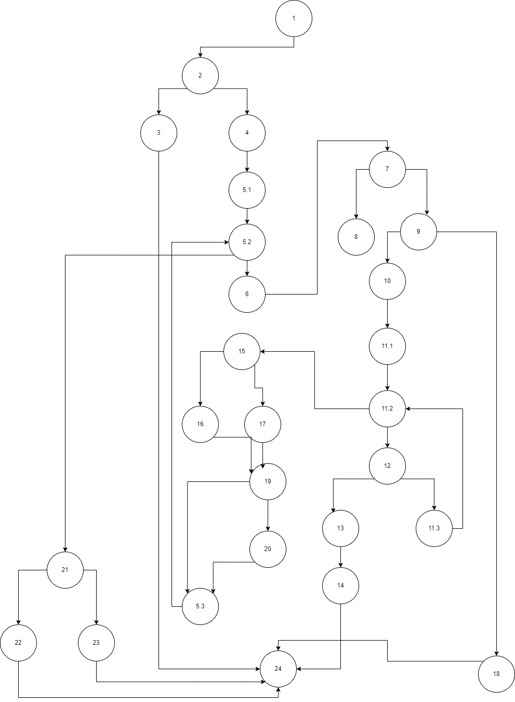

Елена Николовска 225004

2. Control Flow Graph 

Поделба на јазли за Control Flow Graph:
 1. Start
 2.  if (allItems == null) 
 3. throw new RuntimeException("allItems list can't be null!");
 4. float sum = 0;
 5.1 int i = 0;
 5.2 i<allItems.size()
 5.3 i++;
 6. Item item = allItems.get(i);
 7. if (item.getName() == null || item.getName().length() == 0) 
 8.  {item.setName("unknown");}
 9. if (item.getBarcode() != null)
 10. String allowed = "0123456789"; char chars[] = item.getBarcode().toCharArray();
 11.1 int j = 0
 11.2 j < item.getBarcode().length();
 11.3  j++;
 12 char c = item.getBarcode().charAt(j);
 13 if (allowed.indexOf(c) == -1)
 14. throw new RuntimeException("Invalid character in item barcode!");
 15. if (item.getDiscount() > 0)
 16. { sum += item.getPrice()*item.getDiscount(); }
 17. sum += item.getPrice();
 18. throw new RuntimeException("No barcode!");
 19. if (item.getPrice() > 300 && item.getDiscount() > 0 && item.getBarcode().charAt(0) == '0')
 20. sum-=30;
 21. if(sum<=payment)
 22. return true;
 23. return false;
 24. End

3. Цикломатската комплексност
Цикломатската комплексност на графот може да се пресмета со две формули:
	1.C = E – N + 2
	C = комплексноста
	E  = број на ребра
	N = број на јазли
	Во горниот граф има 36 ребра и 28 јазли. 
	Според формулата:
	C = 36 – 28 + 2 = 10 
 
	2.C = P + 1
	P = број на предикатни јазли
	Во графот имаме 9 предикатни јазли и затоа комплексноста е еднаква на 10. 

4. Тест случаи според Every Branch критериумот

За сите тест примери освен во оние за кои е наведено поинаку, payment = 100.
1. allItems = null payment = random number во мојот случај 100
Овој тест пример поминува низ 1 и 2 јазел и во 3 јазел фрла исклучок: RuntimeException("allItems list can't be null!") и излегува од програмата.
Јазли кои ги поминува се 1, 2, 3, 23;

2. Во вториот тест случај имам еден Item во листата кој е  креиран со празно име: new Item("", "123456", 100, 0)
Во овој случај, програмата ќе влезе во условот if (item.getName() == null || item.getName().length() == 0){ item.setName("unknown"); } и ќе го постави името на unknown со што продолжува да ја извршува програмата која ќе врати true на крај.
Бидејќи променливата discount е еднаква на 0, таа ќе влезе во else { sum += item.getPrice(); } и бидејќи променливите sum и payment се еднакви ќе влезе во јазел со број 22.
Јазли кои ги поминува: 1,  2,  4,  5.1,  5.2,  6,  7,  8,  9, 10, 11.1, 11.2, 12, 13, 11.3, 15, 17,19, 5.3, 21, 22, 24.

3. Во третиот тест случај имам еден Item во листата кој е креиран со barcode кој има вредност null:
new Item("Item1", null, 100, 0)
Во овој случај програмата нема да влезе во условот  if (item.getBarcode() != null), односно ќе влезе во else { throw new RuntimeException("No barcode!"); } и ќе фрли исклучок со што ќе заврши програмата.
Јазли кои ги поминува се: 1, 2, 4, 5.1, 5.2. 6, 7, 9, 18, 24.

4. Во четвртиот тест случај имам еден Item во листата кој е креиран со невалиден карактер во barcode:
new Item("Item1", "123a56", 100, 0)
Во овој случај програмата ќе влезе во условот  if (allowed.indexOf(c) == -1) и ќе фрли исклучок RuntimeException("Invalid character in item barcode!"); со што ќе заврши програмата.
Јазли кои ги поминува се: 1, 2, 4, 5.1, 5.2, 6, 7, 9, 10, 11.1, 11.2, 12, 13, 14, 24.

5. Во  петиот тест случај имам еден Item во листата кој е креиран со new Item("Item1", "123456", 100, 0.1f) со цел да се провери discount променливата.
Бидејќи променливата discount е поголема од 0, овој тест пример го исполнува условот if (item.getDiscount() > 0) во јазелот 15 и затоа следниот јазел што го изминува е 16.
Јазли кои ги поминува се: 1, 2, 4, 5.1, 5.2, 6, 7, 9, 10, 11.1, 11.2, 12, 13, 11.3, 15, 16,19, 5.3, 21, 22, 24;

6. Во шестиот тест случај имам еден Item во листата кој е креиран со new Item("Item1", "123456", 100, 0) со цел да се провери discount променливата кога таа е еднаква на 0.
Бидејќи променливата discount е еднаква на 0, овој тест пример не го исполнува условот if (item.getDiscount() > 0) во јазелот 15 и затоа го прескокнува јазелот 16 и оди на јазелот 17.
Јазли кои ги поминува се: 1, 2, 4, 5.1, 5.2, 6, 7, 9, 10, 11.1, 11.2, 12, 13, 11.3, 15, 17, 19, 5.3, 21, 22, 24.

7. Во седмиот тест случај имам еден Item во листата кој е креиран со new Item("Item1", "012345", 350, 0.1f) со цел да се провери случајот if (item.getPrice() > 300 && item.getDiscount() > 0 && item.getBarcode().charAt(0) == '0').
Јазли кои ги поминува се: 1, 2, 4, 5.1, 5.2, 6, 7, 9, 10, 11.1, 11.2, 12, 13, 11.3, 15, 16, 19, 20, 5.3, 21, 22, 24.

8. Во осмиот тест случај имам еден Item во листата кој е креиран со new Item("Item1", "123456", 100, 0.1f) со цел да се провери случајот кога sum > payment, и затоа во овој случај payment = 5.
Како резултат на таа проверка од функцијата добиваме false.
Јазли кои ги поминува се: 1, 2, 4, 5.1, 5.2, 6, 7, 9, 10, 11.1, 11.2, 12, 13, 11.3, 15, 16, 19, 5.3, 21, 23, 24.

9. Во деветтиот тест случај имам еден Item во листата кој е креиран со new Item("Item1", "123456", 100, 0) со вредности на sum и payment кои го исполнуваат условот if (sum <= payment). 
Како резултат на таа проверка од функцијата добиваме true.
Јазли кои ги поминува се: 1, 2, 4, 5.1, 5.2, 6, 7, 9, 10, 11.1, 11.2, 12, 13, 11.3, 15, 17, 19, 5.3, 21, 22, 24.

5. Тест случаи според Multiple Condition критериум

За условот if (item.getPrice() > 300 && item.getDiscount() > 0 && item.getBarcode().charAt(0) == '0') да помине мора да се исполнети сите 3 услови:

item.getPrice() > 300
item.getDiscount() > 0
item.getBarcode().charAt(0) == '0'

Доколку првиот или вториот услов не е исполнет нема да ни бидат важни останатите услови па затоа  од 8 можни комбинации на тест примери ние креираме 4 тест примери:

Првиот услов: TTT
Со new Item("Item1", "012345", 350, 0.1f) имаме
price= 350 > 300
discount=0.1 > 0
barcode = "012345"  со charAt(0) == '0'

Вториот услов: TTF
Со new Item("Item1", "112345", 350, 0.1f) имаме
price= 350 > 300
discount=0.1 > 0
barcode = "112345" и не го исполнуваме charAt(0) == '0'

Третиот услов: TFN  N:not important
Со new Item("Item1", "012345", 350, 0f) имаме
price= 350 > 300
discount=0 > 0 не го исполнува
barcode = "012345"  со charAt(0) == '0' и да не го исполнуваше нема да е важно

Четвртиот услов: FNN
Со new Item("Item1", "012345", 250, 0.1f) имаме
price= 250 > 300 не исполнува
discount=0.1 > 0 не е важно
barcode = "012345"  со charAt(0) == '0' не е важно

6. Unit тестирања

За Every Branch критериумот:

1. RuntimeException thrown = assertThrows( RuntimeException.class, () -> SILab2.checkCart(null, 100) ); assertTrue(thrown.getMessage().contains("allItems list can't be null!"));
Фрламе исклучок поради allItems = null.
2. boolean result = SILab2.checkCart(items, 100); assertTrue(result); assertEquals("unknown", items.get(0).getName());
Проверка за името, каде го поставуваме на "unknown".
3. thrown = assertThrows( RuntimeException.class, () -> SILab2.checkCart(items1, 100) ); assertTrue(thrown.getMessage().contains("No barcode!"));
Фрламе исклучок поради barcode = null.
4. thrown = assertThrows( RuntimeException.class, () -> SILab2.checkCart(items2, 100) ); assertTrue(thrown.getMessage().contains("Invalid character in item barcode!"));
Фрламе исклучок поради невалиден карактер во barcode.
5. result = SILab2.checkCart(items3, 10); assertTrue(result);
6. result = SILab2.checkCart(items4, 100); assertTrue(result);
7. result = SILab2.checkCart(items5, 285); assertTrue(result);
8. result = SILab2.checkCart(items6, 5); assertFalse(result); 
9. result = SILab2.checkCart(items7, 100); assertTrue(result);

За Multiple Condition критериум

1. result = SILab2.checkCart(items, 285); assertTrue(result); 
2. result = SILab2.checkCart(items, 35); assertTrue(result); 
3. result = SILab2.checkCart(items, 350); assertTrue(result);
4. result = SILab2.checkCart(items, 25); assertTrue(result); 

